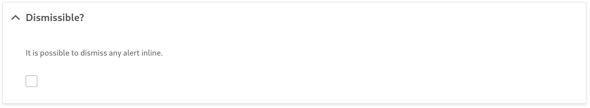
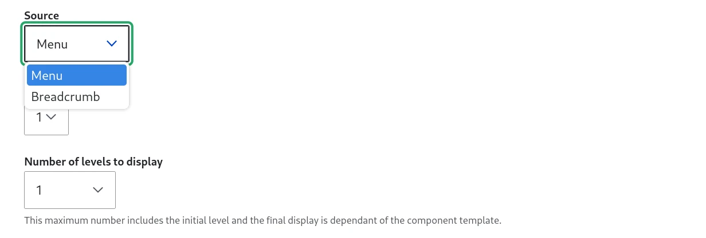
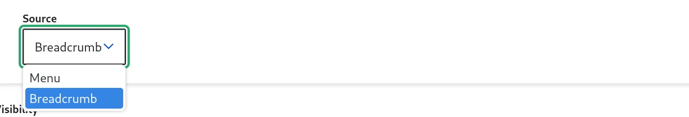
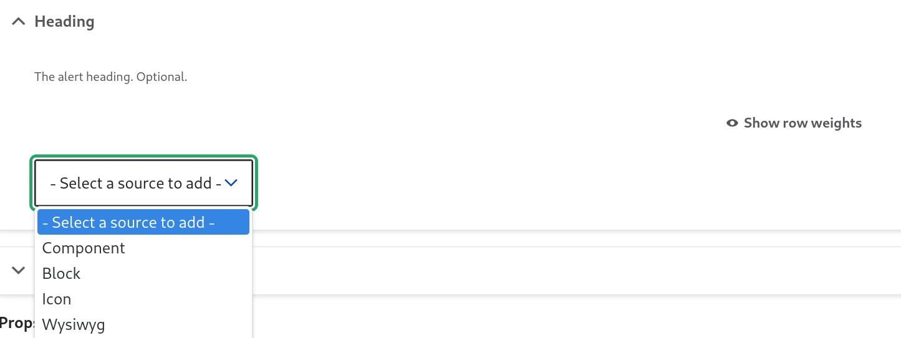
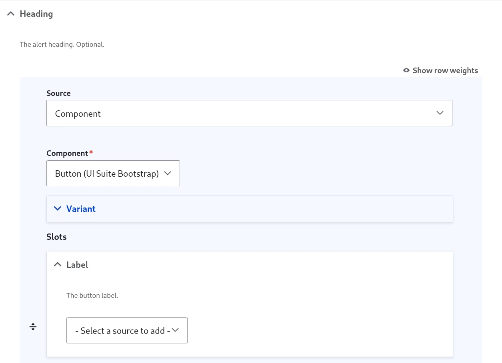

# Component form

The biggest feature of UI Patterns is the generation of forms from the component definition:

| From component definition....     | ... to component form   |
| --------------------------------- | ----------------------- |
|  |  |

Those forms will be shown everywhere a component is used:

- [as blocks](1-as-block.md)
- [as layouts](1-as-block.md)
- [in field formatters](1-as-block.md)
- [in views](1-as-block.md)
- ...

## Data sources

Values are taken from sources:

- "Widgets": simple form elements storing directly the data filled by the user. For example, a `textfield` for a string or a `checkbox` for a boolean.
- Sources retrieving data from Drupal API: they can be context agnostic (ex: a menu for links) or context specific (ex: the title field for a string)
- Context switchers: They don't retrieve data, but they give access to other data sources. For example, the author fields from an article content.

If there is only a single source available, the source form is directly displayed:

If there are at least 2, a source selector is shown:

Some sources don't have a form, selecting the source is enough:

### Data sources from other prop types

Sources are available according to the prop type:

- the breadcrumb for `links` props
- an entity link for `url` props
- a WYSIWYG for slots

However, sources from other prop types are also available when the data can be converted from the more specific to the less specific:

For example:

- A URL data source can be used in a string prop because every URL is also a string. However, a string data source can't be used in a URL prop because not every string is a URL
- A string data source can be used in a slot because every string is also a renderable. However, a free renderable source (like ViewField) can't be used in a string prop because not every renderable is a string.

## Context

Sometimes sources require another object to retrieve the data. This is known as context.

Some sources don't need a context and are site wide, for example:

- All “widgets” which are source plugins with only direct input: Textfield, Select, Checkbox…
- List of all menus
- The breadcrumb
- …

Some sources need a context. Examples:

| Context        | Source              | Prop type |
| -------------- | ------------------- | --------- |
| Content entity | [Entity] link       | URL       |
| Field          | [Field] Formatter   | Slot      |
| Field          | [Field] label       | String    |
| Field item     | [Field item] {prop} | (many)    |
| View           | View title          | String    |
| View           | View rows           | Slot      |
| View           | View field          | Slot      |

Some sources need a context and are switching the context instead of providing data. Examples:

| Initial context      | Source                             | New context    |
| -------------------- | ---------------------------------- | -------------- |
| Content entity       | [Entity] ➜ [Field]                 | Field          |
| Content entity       | [Entity] ➜ Referenced [Entity]     | Content entity |
| Reference field item | [Field item] ➜ Referenced [Entity] | Content entity |

## Variant selector

Some components have variants, a list of different "looks" of the component. Variants don't change the model or the meaning of the component, only the look.

## Slots

SDC components are made of slots & props:

- **Slots**: “areas” for free renderables only, like Drupal blocks or other SDC components for example.
- **Props**: strictly typed data only, for some UI logic in the template.

You can draw the slot areas in a component screenshot:

For each slot, it is possible to add one or many sources:

For example:

- "Component": nest another SDC component in the slot.
- "Block": add a Drupal block plugin
- "Wysiwyg": a simple text editor, using the text formats defined in your site.

Other modules can add other sources. For example, "Icon" in this screenshot is brought by https://www.drupal.org/project/ui_icons

Once a source is added, it can be configured and we can add more because the selector is still present:

Sources can be reordered inside a slot.

Using the "Component" source, we have access to the embedded component slots and we can nest data:

## Props

A bit like the form for slots with 2 main differences:

- We don’t allow multiple items, so we can replace the source but not add some (and of course no reordering)
- The default source form is already loaded.

The available sources are varying according to both:

- the prop type. Each prop as a type, which is related to its JSON schema typing, but not exactly the same. You can check what type has a prop in the [component library](../2-authors/1-stories-and-library.md). A prop without a type is not displayed in the form.
- the context, as explained before.
