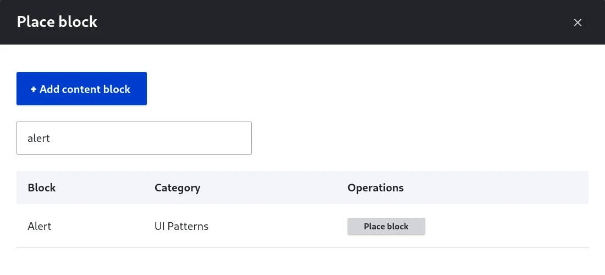
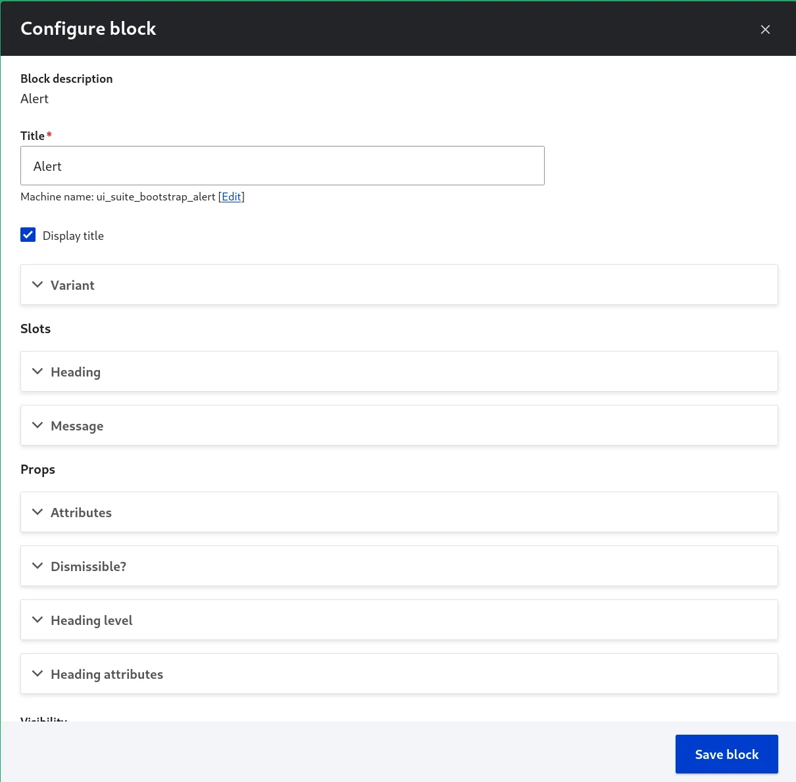
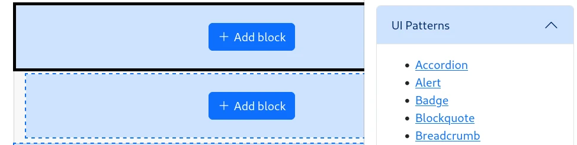
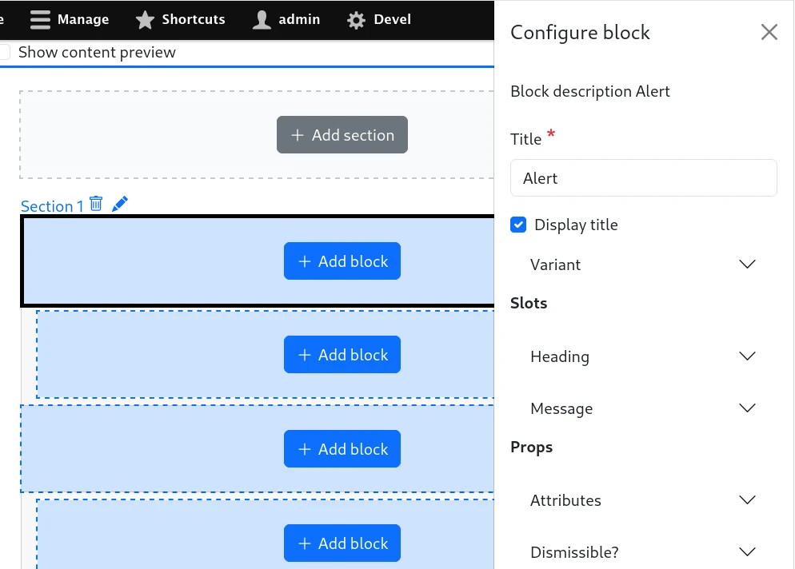

# Using a component as a Drupal block

You need to activate `ui_patterns_blocks` sub-module.

Blocks are boxes of content rendered into an area, or region, of a web page (such as "User Login" or "Who's online") that can be displayed in regions (such as footer or sidebar) on your page or content display.

## In Block Layout (`/admin/structure/block`)

Every UI component is a Drupal block plugin, available in the "Place block" modal:

For example, to assign any component in the Header region, click on "Place Block" button and choose the component to be placed in this particular region.

The component is configurable as an usual block plugin, with the [Component form](0-component-form.md) alongside the block title, the visibility settings and the block placement:

### Contextual data sources

There is no specific context here. Only the generic data sources are available.

## In Layout Builder

Drupal's Layout Builder allows content editors and site builders to create visual layouts for displaying content. Users can customize how content is arranged on a single page, across types of content, or even create custom landing pages with an easy to use drag-and-drop interface.

The Layout Builder provides the ability to drag and drop site-wide blocks and content fields into regions within a given layout.

Component props are available in the sidebar as block settings:

### Contextual data sources

| Context        | Source                         | Prop type |
| -------------- | ------------------------------ | --------- |
| Content entity | [Entity] ➜ [Field]             |           |
| Content entity | [Entity] Link                  | URL       |
| Content entity | [Entity] ➜ Referenced [Entity] |           |
