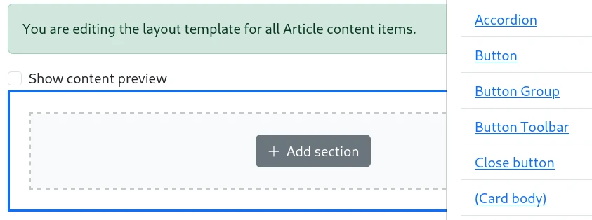
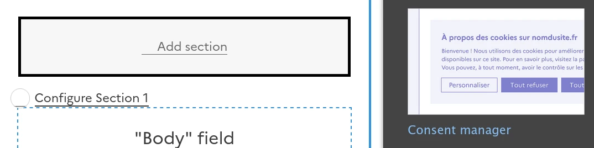
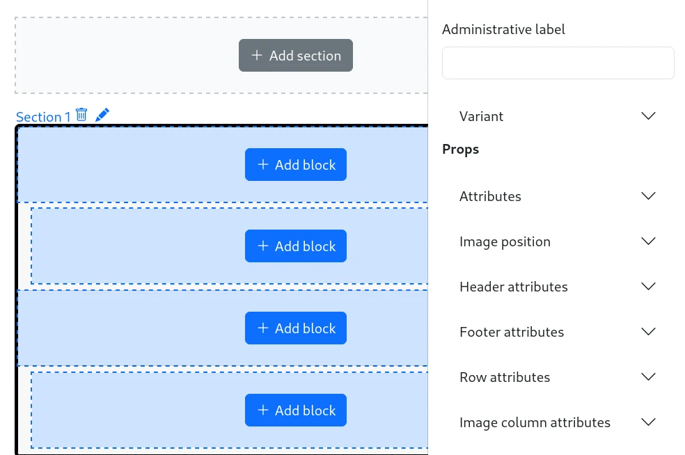

# Using a component as a layout

You need to activate `ui_patterns_layouts` sub-module.

## Layout plugins

SDC components have a model quite similar to Drupal layout plugins:

- Component slots are layout plugin regions
- Component props are layout plugin settings

## In Layout Builder

Drupal's Layout Builder allows content editors and site builders to create visual layouts for displaying content. Users can customize how content is arranged on a single page, across types of content, or even create custom landing pages with an easy to use drag-and-drop interface.

The Layout Builder provides the ability to drag and drop site-wide blocks and content fields into regions within a given layout.

Each section can contain content arranged in a certain layout. Each UI component is exposed as a layout plugin:

If a component has a `thumbnail.webp`, it will be shown in the layouts list:

Section configuration is a [Component form](0-component-form.md), without the slots because slots are directly managed by Layout Builder as regions of the layout:

### Contextual data sources

There is no UI Patterns sources for slots here because slots are directly managed by Layout Builder as regions. So, only Drupal blocks plugins are available.

| Context        | Source                         | Prop type |
| -------------- | ------------------------------ | --------- |
| Content entity | [Entity] ➜ [Field]             |           |
| Content entity | [Entity] Link                  | URL       |
| Content entity | [Entity] ➜ Referenced [Entity] |           |
