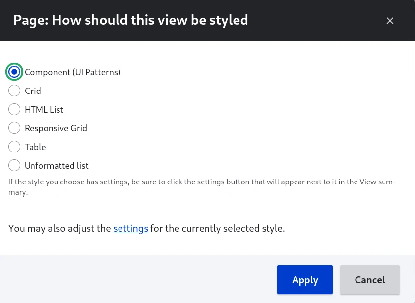
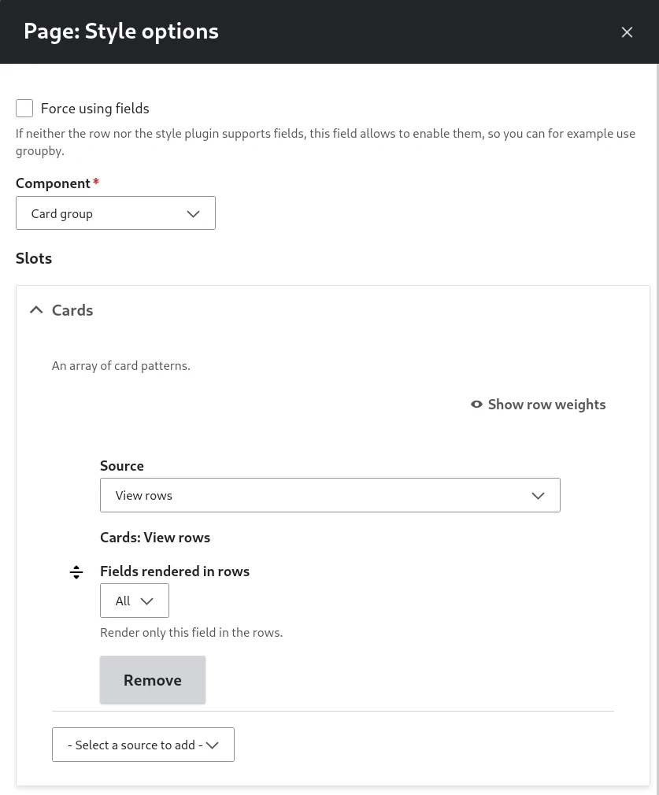
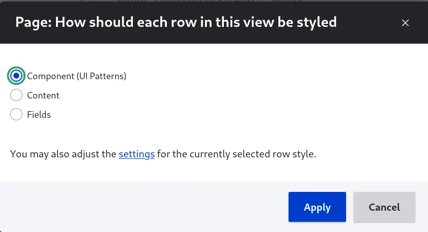
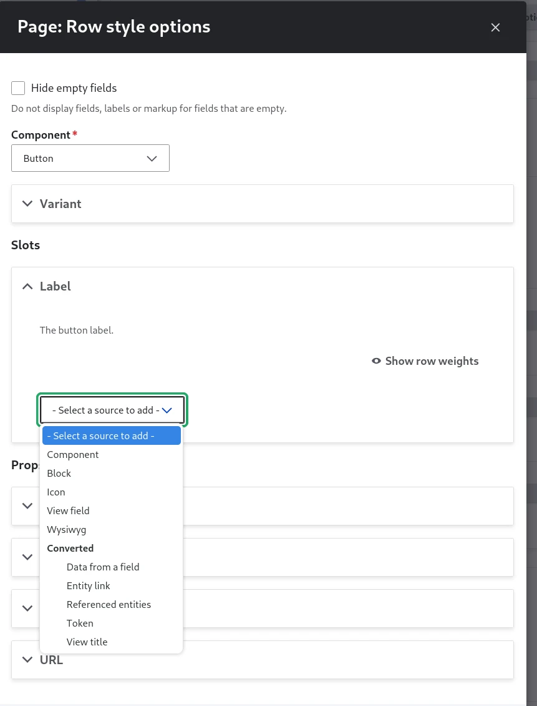

# Using a component with Views

Drupal Views is both:

- a query builder: fetch content from the database, with filters, sorts and grouping.
- a display builder: present the results as lists, galleries, tables, maps, graphs, reports...

You need to activate `ui_patterns_views` sub-module.

## View style plugin

To build the display around the results:

- the table and not the rows
- the slider and not the slides
- the map and not the points of interest
- the mosaic and not the pictures

### Steps

Pick "Component" in the modal:

Select the component and fill the configuration form:

[Component form](0-component-form.md)

### Contextual data sources

| Context | Source     | Prop type |
| ------- | ---------- | --------- |
| View    | View title | String    |
| View    | View rows  | Slot      |

## View row plugin

To build the display of each result:

- the rows instead of the table
- the sliders instead of the slides
- the point of interests instead of the map
- the pictures instead of the mosaic

Pick "Component" in the modal:

Select the component and fill the configuration form:

### Contextual data sources

| Context        | Source                         | Prop type |
| -------------- | ------------------------------ | --------- |
| View row       | View title                     | String    |
| View row       | View field                     | Slot      |
| Content entity | [Entity] ➜ [Field]             |           |
| Content entity | [Entity] Link                  | URL       |
| Content entity | [Entity] ➜ Referenced [Entity] |           |
