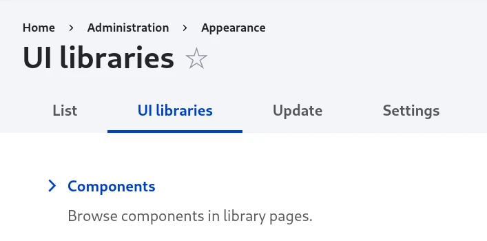
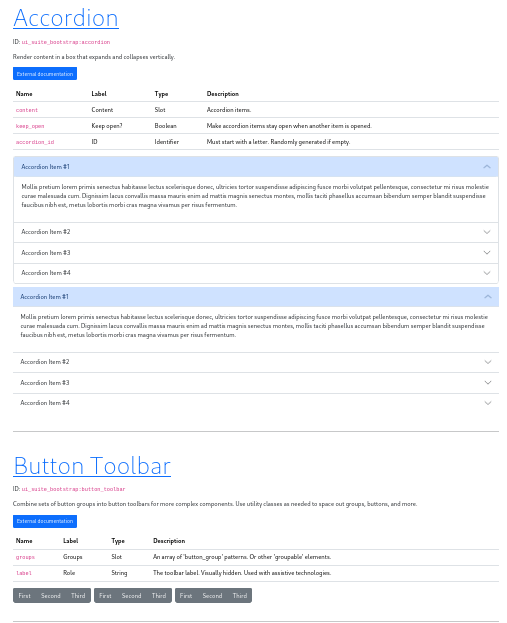
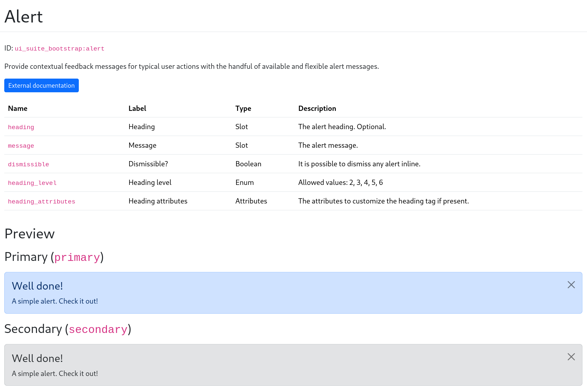

# Component libraries and stories

While you are authoring your component, or when you are showing your work to the stakeholders, you can use the component library.

You need to activate `ui_patterns_library` sub-module for both:

- being able to declare stories
- browse the components and their stories in a component library

## Stories

A story is a data that describes how to render a component. You can have multiple stories per component, to describe all the “interesting” states a component can support.

Stories are for documentation only.

### Discovery

Each story will have its own YML file:

- to not clutter the component definition file.
- sub themes and additional modules can add stories to existing components.

They are expected to be found in the `components/` folder with this name: `{component_id}.{story_id}.story.yml`

There is an optional `component` key in the story definition:

- If missing, the related component will be the one of the current folder. So, it is optional when stories files are in the same folder as the component.
- If present, the component will be the value of the property, so sub themes and additional modules can add stories to existing components.

Example of a story targeting a component defined elsewhere:

```yaml
name: In latin
component: "bootstrap:card"
slots:
  title: "Dapibus ac facilisis"
  subtitle: "Cras justo odio"
props:
  heading_level: 5
```

### File format

Props are straightforward: they expect values which is valid according to the JSON schema.

#### Slots

Slots are more flexible and are using the render API.

Because slots are "normal" Drupal render arrays, it is possible to nest components:

```yaml
slots:
  bottom:
    type: component
    component: "my_project:transcription"
    slots:
      text: "When they got to the road he stopped the boy with his hand."
      actions:
        type: component
        component: "material:button"
        slots:
          label: Bookmark
```

A slot can have multiple renderables, in a YAML list:

```yaml
slots:
  actions:
    - type: component
      component: "material:button"
      slots:
        label: Bookmark
    - type: component
      component: "material:button"
      slots:
        label: Bookmark
```

Full example:

```yaml
name: Video card
description: A card with a video
slots:
  media:
    type: html_tag
    tag: img
    attributes:
      src: http://example.org/path/to/media.png
  bottom:
    type: component
    component: "my_project:transcription"
    slots:
      text: "When they got to the road he stopped the boy with his hand."
      actions:
        - type: component
          component: "material:button"
          slots:
            label: Bookmark
        - type: component
          component: "material:button"
          slots:
            label: Bookmark
props:
  title: Wanna learn about Drupal?
  date: "2024-05-22 - 11:38pm"
```

The “#” prefix is optional in the slots’ render arrays.

```yaml
slots:
  picture:
    "#type": html_tag
    "#tag": img
    "#attributes":
      src: http://example.org/path/to/media.png
```

is the same as:

```yaml
slots:
  picture:
    type: html_tag
    tag: img
    attributes:
      src: http://example.org/path/to/media.png
```

#### Library wrappers

```yaml
name: In latin
library_wrapper: '<div class="card">{{ _story }}</div>'
slots:
  title: "Dapibus ac facilisis"
  subtitle: "Cras justo odio"
props:
  heading_level: 5
```

Beware of the underscore in `_story`.

## Library pages

Components library can be found in `/admin/appearance/ui`:



### Overview pages

There is a global component library and one per provider:

- `/admin/appearance/ui/components`
- `/admin/appearance/ui/components/{provider}`



### Component single page

Every component has its own page: `/admin/appearance/ui/components/{provider}/{component_id}`



### Stories

Stories are displayed after the component metadata and the slots/props table.

> ⚠️ If a component has no stories, nothing is displayed after the slots/props table. But this may change in future UI Patterns 2.x versions.

If a story has a variant prop, it will be displayed once. If a story doesn't have a variant prop (the most common case), it will be displayed for each variant.

### Overriding library pages

How can I customize the component library?

It may be surprising, but UI Pattens Library is using the old `hook_theme` way of managing templates

- [ui-patterns-component-metadata.html.twig](https://git.drupalcode.org/project/ui_patterns/-/tree/2.0.x/modules/ui_patterns_library/templates/ui-patterns-component-metadata.html.twig): Component metadata (description, status, links, tags...)
- [ui-patterns-component-table.html.twig](https://git.drupalcode.org/project/ui_patterns/-/tree/2.0.x/modules/ui_patterns_library/templates/ui-patterns-component-table.html.twig): Table of slots & props
- [ui-patterns-overview-page.html.twig](https://git.drupalcode.org/project/ui_patterns/-/tree/2.0.x/modules/ui_patterns_library/templates/ui-patterns-overview-page.html.twig): Overview page.
- [ui-patterns-overview-quicklinks.html.twig](https://git.drupalcode.org/project/ui_patterns/-/tree/2.0.x/modules/ui_patterns_library/templates/ui-patterns-overview-quicklinks.html.twig): Quicklinks, used in overview page.
- [ui-patterns-single-page.html.twig](https://git.drupalcode.org/project/ui_patterns/-/tree/2.0.x/modules/ui_patterns_library/templates/ui-patterns-single-page.html.twig): Single page.
- [ui-patterns-stories-compact.html.twig](https://git.drupalcode.org/project/ui_patterns/-/tree/2.0.x/modules/ui_patterns_library/templates/ui-patterns-stories-compact.html.twig): Stories without the stories and variants metadata. Used in the overview page.
- [ui-patterns-stories-full.html.twi](https://git.drupalcode.org/project/ui_patterns/-/tree/2.0.x/modules/ui_patterns_library/templates/ui-patterns-stories-full.html.twig): Stories with the stories and variants metadata. Used in the single component page.

So, you can copy and override any of those templates in your own Drupal theme to customize the library the way you want.

> ⚠️ We plan to switch to SDC components and display building for UI Patterns 2.1 or 2.2: [#3438360](https://www.drupal.org/project/ui_patterns/issues/3438360). It will break stuff.
