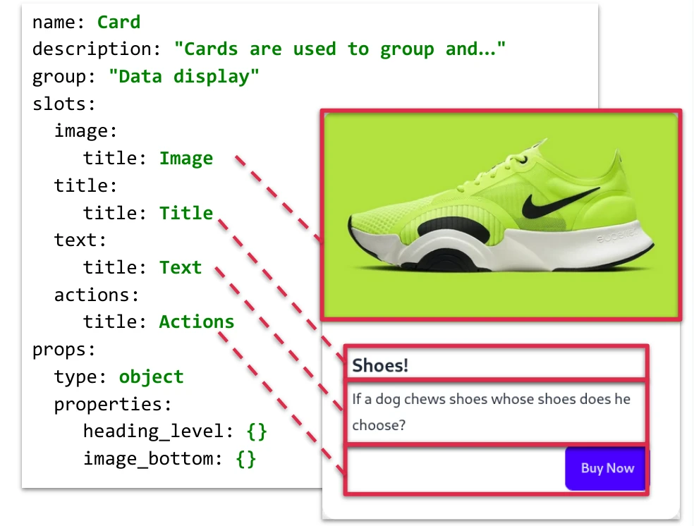

# Best practices for component authoring

> ⚠️ The most important good practices can be automatically audited with Drupal's [sdv_devel](https://www.drupal.org/project/sdc_devel) module, and will be described in `sdc_devel` document. The present documentation is only for non auditable, mostly secondary, good practices.

## Component definition: Metadata

### Stay business agnostic while naming component

For example:

- Don't use words relative to the data model, or business structure
- If possible, use the BEM block name of the root element as a component name

✅ Do:

- Card
- Carousel
- Carousel item

🚫 Don't:

- Event card
- Article card
- News slideshow

## Component definition: Variants

### Use variants when needed

A variant is a different visual version of the component. It has a label and a description. All variants share the same data model, they may not use some slots or props, but they do the same use of the slots and props.

So, don’t fake it with a prop.

Examples, set four variants in a component:

```yaml
label: Button Group
variants:
  default:
    title: Default
  vertical:
    title: Vertical
    description: Make a set of buttons appear vertically stacked rather than horizontally. Split button dropdowns are not supported here.
  lg:
    title: Large
  sm:
    title: Small
```

And then add the modifier class in the Twig template based on the variant name:

```twig

<div{{ attributes.addClass('btn-group') }}</div>
```

Sometimes, a variant can be split between multiple modifier classes:

```twig


<div{{ attributes.addClass(progress-bar) }}>
```

### Always set a default variant

Each component with variants must be rendered correctly, in the most expected way if no variant is specified.

It is common to name it “default”, but it can be any name. It must act the same as a missing or empty “variant” value:

```twig

<div{{ attributes.addClass('btn-group') }}</div>
```

Your default variant can have any name. For example, `vertical`:

```twig

<div{{ attributes.addClass('card') }}</div>
```

### If possible, name variants according to markup

And name it according to markup class names if possible.

In this example:

```html
<button type="button" class="btn btn-primary btn-lg">Large button</button>
<button type="button" class="btn btn-secondary btn-lg">Large button</button>
<button type="button" class="btn btn-primary btn-sm">Small button</button>
<button type="button" class="btn btn-secondary btn-sm">Small button</button>
```

The component is “btn” and the variants are:

- primary\_\_lg
- secondary\_\_lg
- primary\_\_sm
- Secondary\_\_lg

With BEM naming, it is even easier, because blocks are components and blocks modifiers are variants:

```html
<a class="mdc-button" href="http://example.com"></a>
<a class="mdc-button mdc-button--outlined" href="http://example.com"></a>
<a class="mdc-button mdc-button--raised" href="http://example.com"></a>
<a class="mdc-button mdc-button--unelevated" href="http://example.com"></a>
```

The component is “button” and the variants are:

- "" (default)
- outlined
- raised
- unelevated

## Component definition: Slots and props

### Slot or prop?

SDC components are made of slots & props:

- **Slots**: “areas” for free renderables only, like other components.
- **Props**: strictly typed data only, for some UI logic in the template.

You can draw the slots areas in a component screenshot:



Sometimes, for a printable text, deciding between slots and props can be tricky:

- Simple plain text? Only plain text? Forever plain text? ✅ It is a prop.
- Markup or renderable, and the wrapper HTML element is a block (`<div>`, `<section>`...)? ✅ It is a slot
- Markup or renderable, but the wrapper HTML element is a `<p>` or an inline element (`<a>`, `<span>`...) ? ⚠️ That may be tricky.

### Avoid prop drilling

If we have this in the component definition:

```yaml
props:
  type: object
  properties:
    cta:
      type: string
      title: CTA text
    cta_href:
      type: string
      format: uri
      title: CTA link
```

And this in the template:

```twig
<div class="featured__cta-wrapper">
   <a class="button--primary" href="{{ cta_href }}">{{ cta }}</a>
</div>
```

`button--primary` is clearly its own component, distinct from feature, so we have those two issues:

- the button component markup is duplicated in the feature component template, which will cause maintenance issues when the former will evolve
- the feature component is too busy (2 unexpected props!) because of the "prop drilling" (defining props in a component to pass them in a child component)

In this case, we need a cta slot, where it will be possible to inject a button component (or anything else).

### Avoid "drilling' for other renderables.

It is less important than for slots, but the same logic can sometimes be useful for other renderables.

Example: renderable image element instead of “src” prop. That way you can inject your image with field formatters and benefit from the Drupal image manipulation system.

✅ Do:

```yaml
slots:
  picture:
    title: "Picture"
```

In twig:

```twig
{{ picture }}
```

With this injected data:

```yaml
slots:
  picture:
    type: "html_tag"
    tag: "img"
    attributes:
      src: "/path/to/photo.jpg"
      alt: "Hello world"
```

🚫 Instead of:

```yaml
props:
  type: object
  properties:
    label:
      type: "string"
      label: "Label"
   url:
      type: "url"
      label: "URL"
```

```twig

```

### Make sub components easily spottable in library

In other words, components intended to be used only in a specific context.

To be able to distinguish such components:

- Put the component’s label inside parenthesis. (Carousel Item)
- Begin the component’s description with “Internal: ” and describe with which other component the component is intended to be used with.
- Internal: to be used in the 'Carousel' component.
- You can also prefix the component machine name with an underscore
- Use categories to group components together.

> ⚠️ This issue will make this advice obsolete: <a href="https://www.drupal.org/project/ui_patterns/issues/3351682" rel="nofollow">UI Patterns Library: add sub-components</a>.

### Keep slots independent of each others

When working with two sequences of slots, don’t get an item from one using the index of the other one. Because:

- It may break if different number of items
- It will be hard to use in Drupal admin UI

🚫 Don’t (in YML):

```yaml
slots:
  images:
    label: Images
  labels:
    label: Labels
```

With this data:

```yaml
slots:
  images:
    - theme: image
      uri: assets/image-1.webp
    - theme: image
      uri: assets/image-2.jpg
  labels:
    - "Portrait blue"
    - "Landscape yellow"
```

🚫 Don’t (in Twig):

```twig

<li class="mdc-image-list__item">
  {{ image }}
  
  
  <span class="mdc-image-list__label">{{ labels[index] }}</span>
  
</li>

```

✅ A solution may be to create a sub-component.

### Avoid props paradoxes by leveraging orthogonality

🚫 Don't allow the component to be in a state where props values are not compatible with each other:

For example, Daisy UI [Button component](https://daisyui.com/components/button/) has those modified classes:

- `btn-sm`
- `btn-md`
- `btn-lg`
- `btn-xl`
- `btn-wide`
- `btn-block`

Only some of them are mutually exclusive, so props can be implemented like that:

```yaml
props:
  type: object
  properties:
    size:
      type: string
      enum: [xs, sm, md, lg]
    wide:
      type: boolean
    _block:
      type: boolean
    ...
```

### For menus, breadcrumbs, links and pager, use the links prop type

The link prop type offers a unified and consistent way of dealing with (sometimes nested) list of links.

✅ Do: keep the recursive structure and the variable names:

```twig
{{ menus.menu_links(items, attributes, 0) }}


  
    
      <ul{{ attributes }}>
    
      <ul>
    
    
      <li{{ item.attributes }}>
        {{ link(item.title, item.url) }}
         
           {{ _self.menu_links(item.below, attributes, menu_level + 1) }}
         
       </li>
    
   </ul>
  

```

## Definitions: Stories

### Useless lists of renderables in slots

Keep your structure flat.

✅ Do:

```yaml
slots:
  - type: component
    component: "material:card"
    story: long_text
  - type: component
    component: "material:card"
    story: long_text
```

✅ Do:

```yaml
slots:
  type: component
  component: "material:card"
```

🚫 Don't:

```yaml
slots:
  - type: component
    component: "material:card"
```

## Twig templating

### Lint your templates

It is better to lint your templates:

- To help detecting syntax errors and structural problems.
- To keep source code consistent and improve collaboration
- to reduce the diff size in each commit

Drupal is currently evaluating [vincentlanglet/twig-cs-fixer](https://www.drupal.org/project/drupal/issues/3284817) which follows the official Twig Coding Standard Rules.

You can install it and use it without waiting for Core inclusion:

```
composer require --dev vincentlanglet/twig-cs-fixer
```

```
vendor/bin/twig-cs-fixer lint --fix /path/to/code
```

### Be careful with looping

Looping on a slot is a risky thing, because there is no way of knowing if an array is a renderable or a list of renderable. It is not possible to use an <a href="https://twig.symfony.com/doc/3.x/tests/iterable.html" rel="nofollow">iterable test</a> because render arrays are considered as iterable.

🚫 For example, this will break if 'slides' value is not a list but a single renderable:

```twig
<div class="carousel-inner" role="listbox">
  
    <div class="carousel-item">
      {{ slide }}
    </div>
  
</div
```

It is also possible to get two or more nested loops (example: a table where every cell is a slot).

✅ Do:

```twig
<div class="carousel-inner" role="listbox">
  
  
    <div class="carousel-item">
      {{ slide }}
    </div>
  
</div
```

### Use the Drupal attributes

The `attributes` variable is automatically on every SDC template and must be used because it is expected by a lot of API:

- SEO modules can insert tagging attributes through it
- Accessibility modules can alter/insert some attribute values (`aria-*`, `role`, `alt`...) through it
- Translation modules can add the `lang` attribute when needed
- Styles utilities modules (like [UI Styles](https://www.drupal.org/project/ui_styles), Style Options...) can insert helper classes through it
- Hypermedia modules (HTMX, Hotwire/Turbo...) can insert triggers and behaviors attributes through it
- Drupal Core's |add_class() and |set_attribute() Twig filters rely on it
- Display builders (like Paragraph Layout, Layout Builder, Experience Builder) can insert annotation through it
- ...

Use it directly in the component wrapper:

✅ Do:

```twig
<a{{ attributes.addClass('ds-btn') }}>
  <i{{ icon_attributes }}></i>
  {{ label }}
</a>
```

✅ Do:

```twig
<div{{ attributes.addClass('ds-quote') }}>
  <i class="ds-quote__icon ds-ico ds-ico-quote-sign"></i>
  <div class="ds-quote__text">
    {{ value }}
  </div>
</div>
```

🚫 Don’t (missing attributes object and the BEM modifier is hardcoded)

```twig
<ul class="ds-nav ds-nav--buttons">
  
  ...
  
</ul>
```

🚫 Don’t (using attribute object twice, or outside the wrapper)

```twig
<div{{ attributes.addClass('ds-quote') }}>
  <i class="ds-quote__icon ds-ico ds-ico-quote-sign"></i>
  <div {{ attributes.addClass('ds-quote__text') }}>
    {{ value }}
  </div>
</div>
```

#### Don’t put renderables in props

Only renderables in slots. No renderables in props.

In a `links` prop:

```yaml
items:
  type: menu
  label: Items
  preview:
    - title:
    	  theme: image
    	  uri: assets/image-1.webp
    - url: "#"
      title:
    	 theme: image
    	 uri: assets/image-2.jpg
```

🚫 Don’t put a render array:

🚫 Don’t (beware of fake slots with mappings):

```yaml
items:
  type: array
  label: Items
  preview:
     - image:
      theme: image
      uri: assets/image-1.webp
     - label: Image 2
  	image:
      theme: image
      uri: assets/image-2.jpg<
```

### Don’t rely on props typing

Props are strongly typed, but the type must not be tested in templates or alter processing. Because:

- The type is set in component definitions and must not change
- There is no safe and reliable way of testing the types in Twig. Source: <a href="https://twig.symfony.com/doc/1.x/tests/index.html" rel="nofollow">https://twig.symfony.com/doc/1.x/tests/index.html</a>
- Type checking to filter out unsafe values must be done before the template execution

### Slots values are totally free and optional

Your component must survive with any components injected in its slots. As if you use a randomizer.

Of course, it doesn’t have to look “clean”, but it doesn’t have to break.

This has also an impact on filters. Filters can be really powerful and save us a lot of time. But they are dependent on existing data structures and can crash if applied to another.

So, most of the filters are forbidden on slots. Except a few filters identified a few slots friendly filters, and called “slot filters” (add_class, set_attributes…), don’t use filters on slots.

### Use default values when props are mandatory

Error proof: nothing  is expected to be mandatory.  Always test your components with only empty values. Of course, it doesn’t have to look “clean”, but it doesn’t have to break.

If you absolutely need a value when processing in the templates, use |default() filter.

🚫 Don’t:

```twig
<h{{ heading_level }}>{{ title}}</h{{ heading_level }}>
```

✅ Do:

```twig
{{ set heading_level = heading_level|default(3) }}
<h{{ heading_level }}>{{ title}}</h{{ heading_level }}>
```

### Keep components independent of each other

Let the render arrays do this job of imbrication. So, as the front developer, you have to create nestable templates, but the template nesting is the job of the back developer &amp; the site builders, not yours.

### For unavoidable hardcoded dependencies, use include() function

If you really need to call a component from another component template, use `include()` function:

- with the component ID
- with `with_context = false` to avoid context bleeding

✅ Do:

```twig
include(
  "bootstrap:card",
  {slot_1: foo, slot_2: bar, prop_1: baz, prop_2: true},
  with_context = false
)
```

🚫 Don't call the template path directly:

```twig
include(
  "/templates/includes/other-events.html.twig')",
  {slot_1: foo, slot_2: bar, prop_1: baz, prop_2: true},
  with_context = false
)
```

### Don’t hardcode ID values

Components must be repeatable and nestable, so different instances of the component can’t share the same ID.

Instead, you can:

- Generate the ID with the Twig random() function
- Inject the ID from a prop

🚫 Don’t:

```html
<span id="foo">Lorem ipsum</span>
```

🚫 Don’t:

```twig
{{ attributes.setAttribute("id", "foo") }}
```

✅ Do:

```twig
<span id="{{ id }}">Lorem ipsum</span>
```

✅ Do:

```twig
{{ attributes.setAttribute("id", id) }}
```
