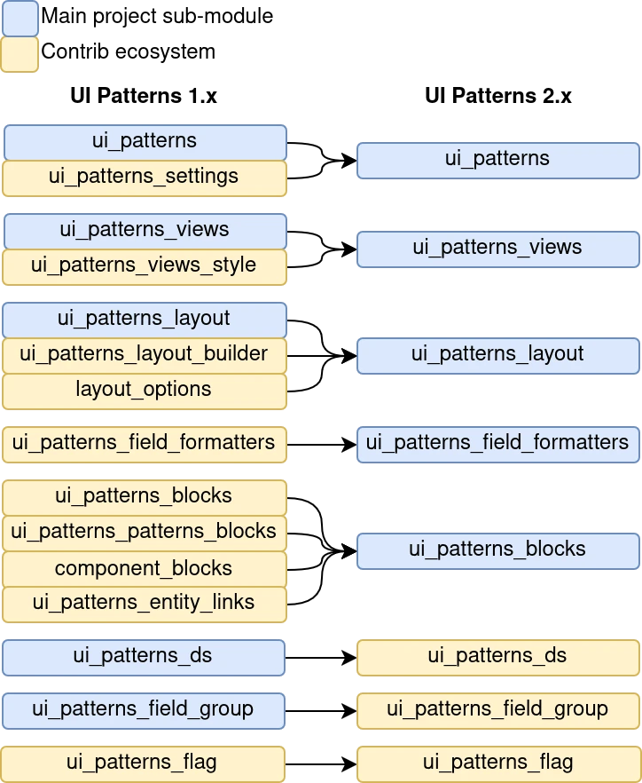

# Migration from UI Patterns 1

# Ecosystem consolidation

If you are coming from UI Patterns 1.x, you may not find UI Patterns 2.x version of your favourite modules on https://www.drupal.org/project/project_module

Maybe because it was merged into an UI Patterns 2.x sub-module:



So, you can now found most of the UI Patterns integration inside the main `ui_patterns` project and 2 sub-modules were moved out of the project:

- Display Suite. Now found in https://www.drupal.org/project/ui_patterns_ds
- Field Group. Now found in https://www.drupal.org/project/ui_patterns_field_group

## Automatic components migration

You need to activate `ui_patterns_legacy` sub-module.

And run:

```bash
drush ui-patterns:migrate my_theme
```

Or:

```bash
drush upm my_theme
```

The converted components can be found in `components/`. `patterns/` folder is kept by the migration, but can be removed.

### Component definitions

It is done automatically by the drush command:

- "fields" are becoming slots
- "settings" are becoming props

| UIP 1.x setting type | UIP2 2.x prop type |
| -------------------- | ------------------ |
| Attributes           | attributes         |
| Boolean              | boolean            |
| Checkboxes           | list               |
| Links                | links              |
| Machine Name         | identifier         |
| Number               | number             |
| Radios               | enum               |
| Select               | enum               |
| Textfield            | string             |
| Token                | string             |
| Url                  | url                |

⚠️ Some features, mixing data structure and data sources, don't make sense with SDC and are ignored during migration:

- `allow_variant_token` (on component level) and `allow_token` (on setting level): Replaced by the Token source plugin used with the Variant or any other prop type.
- `allow_variant_expose` (on component level) and `allow_variant_expose` (on setting level): Replaced by the `ui_patterns_source` field type (expected for UI Patterns 2.1). You can attach a ui_patterns_source field and select the variant or any other property in the field widget and display this field inside your entity form.
- `expose_as_field` (on setting level): Also replaced by the `ui_patterns_source` field type. Mapping a property to a specific field is removed.

Anyway, there are a few tasks you may want to do after that:

#### identifier props

In UI Patterns 1.x, `machine_name` setting type was overlooked because:

- it was added late (mid 2023)
- it was not compatible with the broadly used `token` source

In UI Patterns 2.x, it was replaced by `identifier` prop type can be used without those limitations.

#### number props

In UI Patterns 1.x, `number` setting type doesn't allow to tell when a number is a decimal or an integer.

In UI Patterns 2.x, you can replace `type: number` by `type: integer`.

#### Ignored setting types

Those settings are not migrated:

- ColorWidget
- ColorisWidget
- GroupType
- LanguageCheckboxes
- LanguageAccess
- MediaLibrary
- Publish

### Templates

The templates are exactly the same between UI Patterns 1.x and UI Patterns 2.x, except `pattern()` function which has been replaced by the Twig native `include()` function:

```twig
pattern(
  "card",
  {slot_1: foo, slot_2: bar, prop_1: baz, prop_2: true},
  variant_id
)
```

becomes:

```twig
include(
  "bootstrap:card",
  {slot_1: foo, slot_2: bar, prop_1: baz, prop_2: true, variant: variant_id},
  with_context = false
)
```

Differences:

- `component_id` is now prefixed by the provider (theme or module)
- `variant` is now a prop instead of a function parameter
- `with_context = false` must be added to avoid scope leaks.

Until the manual conversion is done, you can still use `pattern()` thanks to a compatibility layer, if you keep `ui_patterns_legacy` activated.

> ⚠️ variants templates (ex: `pattern-card--variant-horizontal.html.twig`) are not kept because they don't exist in UI Patterns 2

### Preview/Stories

A story called `preview` is automatically created from all the `preview` values extracted from the component definition.

For example, this UI Patterns 1.x definition:

```yaml
button:
  label: "Button"
  settings:
    disabled:
      type: "boolean"
      label: "Disabled?"
      preview: false
      allow_token: true
    label_visually_hidden:
      type: "boolean"
      label: "Hide button label?"
      preview: false
    url:
      type: "url"
      label: "URL"
      preview: "https://example.com"
  fields:
    label:
      type: "text"
      label: "Label"
      preview: "Submit"
```

Is becoming this story:

```yaml
name: Preview
slots:
  label: Submit
props:
  disabled: false
  label_visually_hidden: false
  url: "https://example.com"
```

### Preview templates

Preview templates (`pattern-{component_id}--preview.html.twig`) are replaced by `library_wrapper` properties of story definition, but this is not done automatically.

## Compatibility layer at runtime

By keeping `ui_patterns_legacy` activated after the migration, you can leverage a compatibility layer between UI Patterns 1.x and SDC API.

### Render elements

For example, this render element:

```php
[
  '#type' => 'pattern',
  '#id' => 'blockquote',
  '#variant' => 'highlighted',
  '#fields' => [
    'quote' => 'You must do the things you think you cannot do.',
    'attribution' => 'Eleanor Roosevelt',
   ],
  '#settings' => [
     'url' => 'https://example.org'
  ]
]
```

And this one:

```php
[
  '#type' => 'pattern',
  '#id' => 'blockquote',
  '#variant' => 'highlighted',
  'quote' => 'You must do the things you think you cannot do.',
  'attribution' => 'Eleanor Roosevelt',
   'url' => 'https://example.org'
]
```

Are both converted to:

```php
[
  '#type' => 'component',
  '#component' => 'provider:blockquote',
  '#slots' => [
    'quote' => 'You must do the things you think you cannot do.',
    'attribution' => 'Eleanor Roosevelt',
   ],
  '#props' => [
     'url' => 'https://example.org',
     'variant' => 'highlighted'
  ]
]
```

It works also for `pattern_preview` render element:

```php
[
  '#type' => 'pattern_preview',
  '#id' => 'blockquote',
  '#variant' => 'highlighted',
]
```

Is converted at runtime to:

```php
[
  '#type' => 'component',
  '#component' => 'provider:blockquote',
  '#story' => 'preview',
  '#props' => [
     'variant' => 'highlighted'
  ]
]
```

### Twig functions

At runtime, `pattern()` twig function:

```twig
pattern(
  "card",
  {slot_1: foo, slot_2: bar, prop_1: baz, prop_2: true},
  variant_id
)
```

is processed as:

```php
[
  '#type' => 'component',
  '#component' => 'bootstrap:card',
  '#slots' => [
    'slot_1' => foo,
    'slot_2' => bar,
   ],
  '#props' => [
     'prop_1' => 'baz',
     'prop_2' => true,
     'variant' => 'variant_id'
  ]
]
```

> ⚠️ The provider is guessed. If you have many components with the same ID (so, in this example, many cards), the provider may be guessed wrong.

Same for `pattern_preview`:

```twig
{{ pattern_preview('modal', 'highlighted') }}
```

is processed as:

```php
[
  '#type' => 'component',
  '#component' => 'provider:modal',
  '#story' => 'preview',
  '#props' => [
     'variant' => 'variant_id'
  ]
]
```
