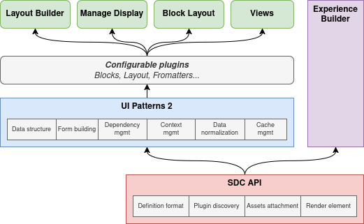

# Frequently Asked Questions

## Questions from components users

### Where are Field Group and Display Suite integrations?

`ui_patterns_ds` and `ui_patterns_field_group` were submodules in 1.0.x branch. These modules are leaving the main project, because we have reorganized the ecosystem:

- integrations with Core APIs is implemented in `ui_patterns` project sub-modules
- integrations with Contrib APIs is implemented in dedicated contrib modules

So, development is happening here:

- https://www.drupal.org/project/ui_patterns_ds
- https://www.drupal.org/project/ui_patterns_field_group

### Is it compatible with `ckeditor_layouts`?

UI Patterns 2.x layout plugins are not compatible with `ckeditor_layouts` [because](https://www.drupal.org/project/ui_patterns/issues/3474131#comment-15907843) the module is loading the layout through the theme manager but SDC is not passing through the theme manager.

```php
$template = ['#theme' => $layout->getThemeHook()];
```

### Do you provide configuration migration (entity displays, views...)?

We provide only code migration for now (2.0.0, February 2025) through the `drush upm` command provided by `ui_patterns_legacy` sub-module.

We plan to propose config migration, but:

- it will be altered in 2025. If you are in a hurry, it is better to rebuild your displays manually.
- we target around 80% of the use cases. If you have a specific usage, it is better to rebuild your displays manually.

### What about Experience Builder?

[Experience Builder](https://www.drupal.org/project/experience_builder), a new display builder expected for late 2025, which will also be shipped with an SDC integration.

UI Patterns 2 is not competing with Experience Builder because it is not a new display builder, it converts SDC components to configurable plugins to be used with existing display builders (Manage Display, Layout Builder, Paragraph Layout, Views...):



However, UIP2 can provide some advanced features (especially about data retrieval from Drupal API to props & slots) to XB if they allow it with an API.

Any compatibility issue between the two modules must be considered as a bug and fixed on XB side, or UIP2 side, or both sides. Making the effort of staying compatible will improve the quality of both solutions: that would mean none of them is doing crazy stuff with SDC.

See:

- https://www.drupal.org/project/ui_patterns/issues/3490873
- https://www.drupal.org/project/drupal_cms/issues/3491465

## Questions from component authors

### What is the relationship with SDC?

UI Patterns 2 is connecting SDC to Drupal API:

- Form building
- Cache management
- Context management
- Config dependencies
- Exposition as configurable plugins (blocks, layouts...)

Also, Pierre ([pdureau](https://www.drupal.org/u/pdureau)) is both a maintainer of SDC in Core and the project manager of UI Patterns 2.

UI Patterns 2.x team have worked hard to stay as close as vanilla SDC as possible, but we have added some extensions. However, all of them will be proposed to Drupal Core: [#3471454: List of related core issues](https://www.drupal.org/project/ui_patterns/issues/3471454).

### Why does my SDC component not work well with UI Patterns 2?

UI Patterns 2 is not expecting you to change your SDC component in order to be compatible.

However, if your component has definitions or templating issues, it will be harder for UI Patterns 2.x to connect it to Drupal API

You can check your component with [sdc_devel](https://www.drupal.org/project/sdc_devel) which provides automatic audits.

A component without error must be compatible with UI Patterns 2.x

### One of my prop has an "Unknown" prop type, why?

If your prop doesn't show up in the component form, or is marked with "Unknown ⚠️" in the component library, it is because its prop type was not guessed from its JSON schema.

See the prop types list in [Authoring a component](2-authors/0-authoring-a-component.md) chapter.

Maybe because the prop schema has something wrong.

Or maybe because the prop type is missing from UI Patterns 2 API. You can propose it by creating a feature request: https://www.drupal.org/project/issues/ui_patterns?categories=All

### Can we deprecate a component?

There is a `status` enum in SDC:

```yaml
status:
  type: string
  title: Development Status
  description:
    Use this property to identify if the component can be safely used in
    production.
  enum:
    - experimental
    - stable
    - deprecated
    - obsolete
```

https://git.drupalcode.org/project/drupal/-/blob/11.x/core/assets/schemas/v1/metadata.schema.json

This information is shown in the component library, but the component is still available for selection.

### Relationship with Storybook module

https://www.drupal.org/project/storybook provides an integration between SDC and Storybook component library.

So it looks like `ui_patterns_library` but the goals are different:

- `storybook` is a development tool, powerful, outside of Drupal, an industry standard, great for the front developers
- `ui_patterns_library` is to check the components once developed, inside Drupal, well integrated in Drupal and the Render API, great for the other stakeholders, without having to go to another tool

Some people use `ui_patterns_library` for local SDC development, because it is good enough for them.

### Relationship with SDC Styleguide module

This module is a friendly competitor to `ui_patterns_library` sub-module.

We are working with SDC Styleguide team to be compatible: [#3464909: Collaboration with UI Patterns 2](https://www.drupal.org/project/sdc_styleguide/issues/3464909)
