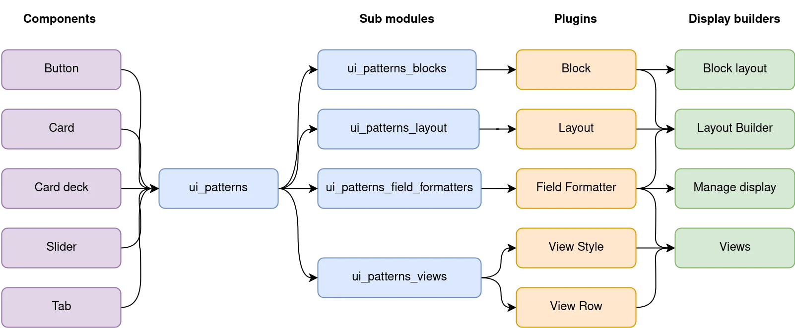

# UI Patterns 2 — SDC in Drupal UI

UI Patterns 2.x load your SDC components as Drupal plugins to make them available in Drupal UI and configuration, for both novice and ambitious site-builders.

UI components are reusable, nestable, guided by clear standards, business agnostics, and can be assembled together to build displays. Examples: card, button, slider, pager, menu, toast...

## Using SDC components in Drupal UI

For each SDC component, UI Patterns is providing an integration with Drupal:

- **From Drupal to SDC**: Build a form from the component slots and props definitions, where it is possible to pull data from many Drupal API (See [Component form](1-users/0-component-form.md) chapter).
- **From SDC to Drupal**: Exposes the components as Drupal plugins.

UI Patterns provides four sub-modules for integration with all Drupal Core display builders (Manage display, Layout Builder, Block layout and Views) and some from contrib too:

- **UI Patterns Blocks** (`ui_patterns_blocks`): expose each component as a Drupal Block plugins. See [Use as block](1-users/1-as-block.md) chapter.
- **UI Patterns Layouts** (`ui_patterns_layouts`): expose each component as a Drupal Layout plugin. See [Use as layout](1-users/2-as-layout.md) chapter.
- **UI Patterns Field Formatters** (`ui_patterns_field_formatters`): use components in Drupal Field Formatters plugins. See [Use in Field Formatters](1-users/3-in-field-formatter.md) chapter.
- **UI Patterns Views** (`ui_patterns_views`): use components as Views styles (all the results in a single component) and View rows (each result in a component) plugins. See [Use with Views](1-users/4-with-views.md) chapter.

On 1.x branch, UI Patterns was also providing integration for:

- Display Suite plugins. Now found in https://www.drupal.org/project/ui_patterns_ds
- Field Group plugins. Now found in https://www.drupal.org/project/ui_patterns_field_group

### No SDC components yet?

You want to try UI Patterns 2.x but you don't have SDC components in your project, you need a theme providing them. For example:

- [ui_suite_bootstrap](https://www.drupal.org/project/ui_suite_bootstrap) provides more than 30 components from the most popular Web design system.
- [ui_suite_dsfr](https://www.drupal.org/project/ui_suite_dsfr) provides 44 components from the French Government design system
- [ui_suite_uswds](https://www.drupal.org/project/ui_suite_uswds) provides 56 components from the US Government design system
- [ui_suite_daisyui](https://www.drupal.org/project/ui_suite_daisyui) provides 38 components from Daisy UI (a famous Tailwind-based design system)
- ...

## Authoring SDC components

To build the best UI components for Drupal, see how to [author a component](2-authors/0-authoring-a-component.md) and some [best practices](2-authors/2-best-practices.md).

Also, two sub-modules to help component authors:

- **UI Patterns Library** (`ui_patterns_library`): Generates component library pages to be used as documentation for content editors or as a showcase for business and clients. See [Add stories to the component library](2-authors/1-stories-and-library.md) chapter.
- **UI Patterns Legacy** (`ui_patterns_legacy`): See [Migration from UI Patterns 1.x](2-authors/3-migration-from-UIP1.md) chapter.

## Extending UI Patterns 2.x

UI Patterns API is based on plugins. You can add your own:

- [Source plugins](3-devs/1-source-plugins.md)
- [Prop type plugins](3-devs/2-prop-type-plugins.md)

You want to go further? See [how UI Patterns works](3-devs/3-internals.md)
