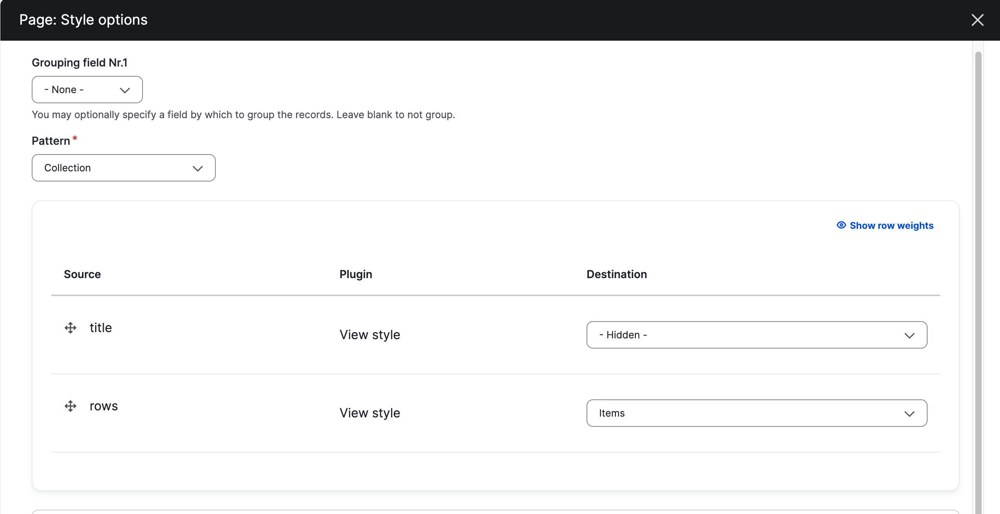
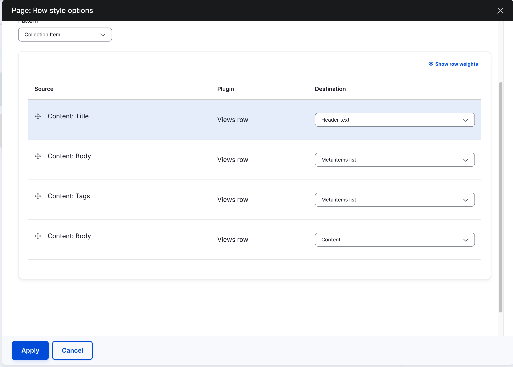
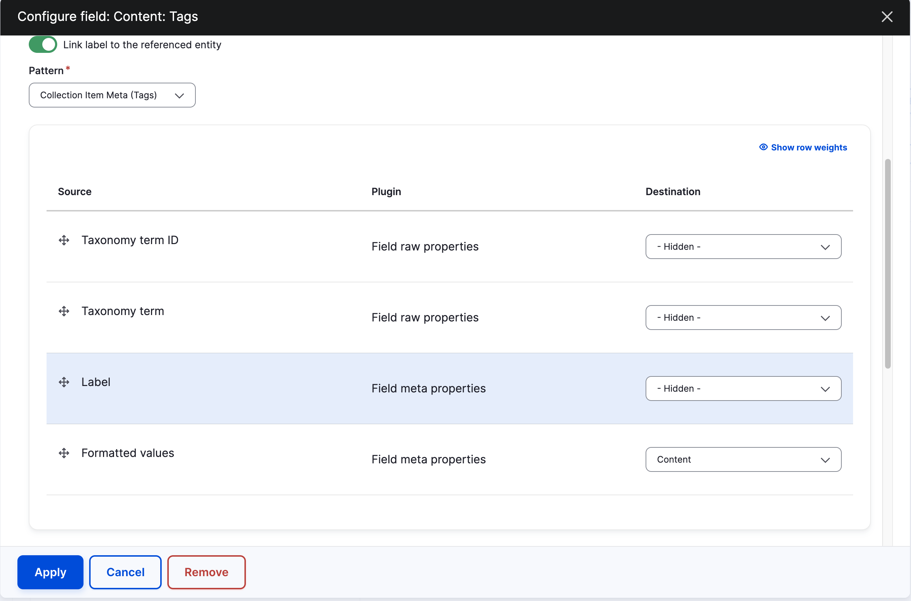

# Examples of how to use Collections

## With a view

### Extra modules needed
- [UI Patterns Views Style](https://www.drupal.org/project/ui_patterns_views_style)

1. On the view page set the Format pattern to be "Collection" and set rows.
   * 
2. See the row pattern to "Collection item" with fields mapped to the collection
   item slots.
  * 
Note: If wanting to use meta tags you will have to edit the display of the
  specific field.  See example below

## With twig

Container and row both have to be set.

See [item-list--search-results.html.twig](../../templates/dataset/item-list--search-results.html.twig)
  for example for setting the container.

See [search-result.html.twig](../../templates/content/search-result.html.twig)
  for example for setting the row.
